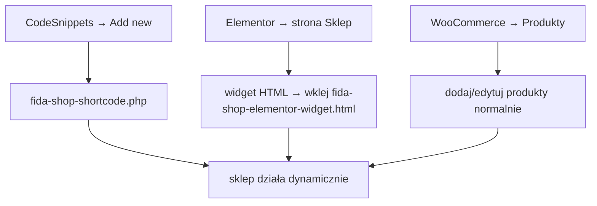

# FIDA SHOP — Baza wiedzy / State dokumentacji

## 1. Architektura (jak to działa)

```
WordPress + WooCommerce (baza danych – produkty, ceny, obrazki, tagi)
        │
        ▼
Code Snippets → fida-shop-shortcode.php  (PHP shortcode [fida_shop])
        │
        ▼
Elementor → HTML Widget → fida-shop-elementor-widget.html  (CSS + shortcode)
        │
        ▼
Przeglądarka → siatka produktów 4 kolumny
```

**Zasada:** WooCommerce przechowuje dane produktów. PHP lajkuje je z bazy przy każdym odświeżeniu strony. HTML widget w Elementorze dostarcza tylko opakowanie (CSS + miejsce na shortcode). Żadne dane produktów nie są już ręcznie wpisywane w HTML.

---

## 2. Gdzie co jest

### Pliki w workspace (`wordpress_fida/fida-shop-plugin/`)

| Plik | Cel | Kiedy edytować |
|---|---|---|
| `fida-shop-shortcode.php` | Kod PHP shortcode'u — generuje dynamiczne karty produktów | Gdy zmienia się struktura karty, jej klasy HTML, typ przycisku, logika ribbonu |
| `fida-shop-elementor-widget.html` | Zawartość widgetu HTML w Elementorze — CSS, tytuł, wywołania shortcode'ów | Gdy zmienia się CSS (layout, fonty, kolory, responsywność) albo tytuł "Wszystkie produkty" |

### Na serwerze (WordPress)

| Miejsce | Co | Zmiany |
|---|---|---|
| **Code Snippets → Add New** | Kod z `fida-shop-shortcode.php` | Tylko gdy edytujesz strukturę karty (patrz pkt 4) |
| **Elementor → edytuj stronę Sklep → widget HTML** | Treść z `fida-shop-elementor-widget.html` | Tylko gdy edytujesz CSS lub tytuł toolbara |
| **WooCommerce → Produkty** | Produkty, ceny, tagi, obrazki | **Codzienna robota** — to jedyne miejsce gdzie zmieniasz dane |

---

## 3. Jak edytować (workflow)

### A. Chcę zmienić cenę / tytuł / obrazek / tag produktu

1. `wp-admin → Produkty` → znajdź produkt → Edit
2. Zmień cenę, tytuł, obrazek, tag (tag `nowosc` włącza ribbon "Nowość")
3. Zapisz
4. Odśwież stronę Sklep (Ctrl+Shift+R) → zmiana widoczna natychmiast

> **Uwaga:** jeśli używasz cache (WP Rocket, LiteSpeed, Cloudflare) → wyczyść cache dla `/sklep/`.

### B. Chcę zmienić CSS (layout, czcionki, mobile, kolory)

1. `Elementor → edytuj stronę Sklep → znajdź widget HTML`
2. W polu edytora znajdź sekcję `<style>…</style>` (na górze)
3. Zmień dowolną regułę CSS
4. Update stronę w Elementorze

> **Uwaga:** nigdy nie edytuj CSS w motywie (`style.css`) ani w Customizerze. CSS sklepu jest TYLKO w widgetcie HTML.

### C. Chcę dodać nowy produkt

1. `wp-admin → Produkty → Dodaj nowy`
2. Wypełnij nazwę, cenę, obrazek, tag (opcjonalnie `nowosc`)
3. Opublikuj
4. Odśwież Sklep → karta pojawia się automatycznie, licznik aktualizuje liczbę

> Jeśli nie działa: sprawdź czy produkt ma status "Published" i czy nie ma błędów w konsoli JS.

### D. Chcę dodać/zmienić funkcję w shortcode (np. dodać gwiazdki)

1. Edytuj snippet w **Code Snippets**
2. Wklej nową wersję kodu z `fida-shop-shortcode.php`
3. Save → Activate → odśwież

---

## 4. Struktura karty produktu (renderowana przez PHP)

```
<li class="wc-block-product post-{ID} … product-type-{simple|variable}">
  ├── .wc-block-components-product-image → <a> → 
  ├── .wp-block-post-title → <a> (tytuł, link do produktu)
  ├── .wp-block-woocommerce-product-price → cena
  └── .wp-block-woocommerce-product-button (przycisk)
        │
        ├── jeśli simple: <button> z AJAX add_to_cart
        │     + ukryty <span> z linkiem "Zobacz koszyk"
        │
        └── jeśli variable: <a> → strona produktu (wybór wariantu)
```

**Key classes:** `wc-block-product`, `wc-block-components-product-image`, `wc-block-components-product-price`, `wc-block-components-product-button__button`

**Data attributes for WC interactivity:** `data-wp-interactive`, `data-wp-context`, `data-wp-on--click`, `data-wp-text`, `data-wp-bind--hidden` — te zapewniają, że przyciski "Dodaj do koszyka" działają bez przeładowania strony.

---

## 5. Ribbon "Nowość"

| Gdzie | Co |
|---|---|
| CSS (w widgecie) | `.fida-shop .wc-block-components-product-image::before { content: "Nowość"; … }` |
| PHP (w shortcode) | `has_term('nowosc', 'product_tag', $product->get_id())` → dodaje klasę `fida-has-nowosc` na `<li>` |
| WooCommerce | Tag produktu o slugu **`nowosc`** włącza ribbon |

**Przyszłościowo:** jeśli chcesz ribbon pokazywać TYLKO na produktach z tagiem, odkomentuj lub dodaj w CSS:
```css
.fida-shop .wc-block-product:not(.fida-has-nowosc) .wc-block-components-product-image::before { content: none; }
```
Obecnie ribbon jest na **KAŻDYM** produkcie (zgodnie z oryginalnym wyglądem).

---

## 6. Parametry shortcode `[fida_shop]`

```
[fida_shop]
[fida_shop orderby="date" order="DESC" per_page="-1" nowosc_tag="nowosc"]
[fida_shop category="breloki"]
```

| Atrybut | Domyślnie | Opcje |
|---|---|---|
| `orderby` | `date` | `date`, `title`, `price`, `menu_order`, `popularity`, `rating`, `id`, `rand` |
| `order` | `DESC` | `DESC`, `ASC` |
| `per_page` | `-1` (wszystkie) | Liczba lub `-1` |
| `nowosc_tag` | `nowosc` | Slug tagu dla ribbonu |
| `category` | `""` (bez filtra) | Slug kategorii, np. `breloki`, `koszulki`, `torby` |

**Przykład:** `[fida_shop category="breloki" orderby="price" order="ASC"]` — tylko breloki, od najtańszych.

---

## 7. Mobile / Responsywność

| Breakpoint | Zmiana |
|---|---|
| ≤960px | Grid 2 kolumny, padding 56px, toolbar kolumnowo, heading 26px |
| ≤480px | Heading 22px, przycisk 11px padding 9×4, tytuł 12px |

Edycja w widgetcie HTML → sekcja `@media`.

---

## 8. Debugowanie / FAQ

| Problem | Prawdopodobna przyczyna | Rozwiązanie |
|---|---|---|
| Cena w sklepie nie zmienia się po edycji w WC | **To już naprawione** — sklep jest dynamiczny | Upewnij się, że Code Snippets jest aktywny |
| "Brak produktów" na stronie sklepu | Snippet nieaktywny lub błąd PHP | Sprawdź Code Snippets → czy włączony, czy nie ma czerwonego błędu; odśwież stronę |
| Licznik pokazuje "0 produktów" | WooCommerce nieaktywne lub brak opublikowanych produktów | `wp-admin → Wtyczki → WooCommerce`; `Produkty → status = Published` |
| Przycisk "Dodaj do koszyka" nie działa | Konflikt JS z inną wtyczką | DevTools → Console → sprawdź błędy JS; zgłoś do autora wtyczki |
| Ribbon "Nowość" na wszystkich produktach (**zgodne z zamówieniem**) | CSS `::before` działa globalnie | Jeśli chcesz warunkowy ribbon → dodaj regułę `:not(.fida-has-nowosc)` w CSS (patrz pkt 5) |

---

## 9. Skrócona instrukcja reinstalacji (gdyby wszystko wywalić)



1. Wróć do tego workspace → otwórz `fida-shop-shortcode.php`
2. Code Snippets → Add New → Functions (PHP) → wklej od `--- POCZĄTEK KODU ---` → Save and Activate
3. Otwórz `fida-shop-elementor-widget.html` → skopiuj całość
4. Elementor → strona Sklep → widget HTML → usuń wszystko → wklej → Update

---

## 10. Historia modyfikacji tej dokumentacji

| Data | Zmiana |
|---|---|
| 2026-06-07 | Utworzenie dokumentu — stan po migracji ze statycznego HTML na shortcode `[fida_shop]` |
